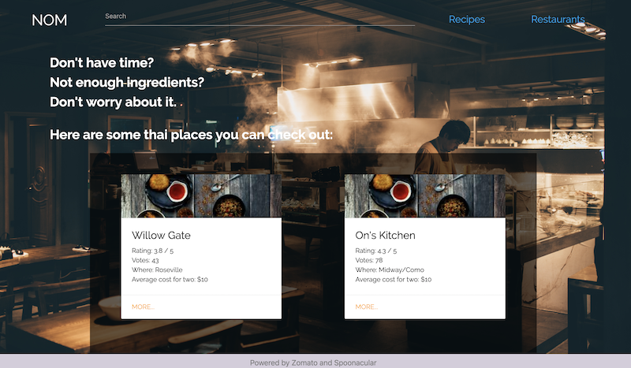

# nom
Group Project 1

## Description
Nom is an app that allows the user to search and find recipes for their favorite types of food
while simutaneously offering the option of discovering nearby restaurants relavant to what kind of food the user is looking for. 

## Link to deployed version
https://adj-dev.github.io/nom

## New technologies
- Materialize
- wireframe.cc (for wireframing)

## Screenshot

## Interesting things
Recipe results are set to random to generate a new set of recipes each time the user clicks recipe. 

## Team members
Deepa Bhujle, Esther Hwang, Jeff Samuels, Ekrama Omar, Andrew Johnson
